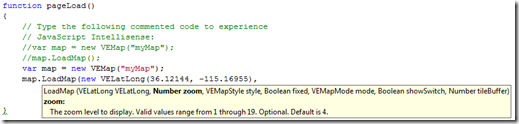

# Bing Maps JavaScript Intellisense Helper

The purpose of this project is to fully enable JavaScript Intellisense for the Bing Maps AJAX Map Control inside of Visual Studio 2008 and higher.

Creating Microsoft Bing Maps mashups and applications just got a whole lot easier. This JavaScript library enables Intellisense for the Bing Maps AJAX control (versions 6.3 and 7) in Visual Studios 2008 and higher.

**FYI, this project was migrated here from Codeplex before it shutdown.**

## Nuget package

Now available as a Nuget Package: [Bing Maps v6.3](http://nuget.org/List/Packages/BingMapsIntellisense_6) and [Bing Maps v7](https://www.nuget.org/packages/BingMapsIntellisense_7)

## v7.0 examples

## v6.3 examples

## Video
A video explaining this project is available at [http://channel9.msdn.com/ShowPost.aspx?PostID=386000](http://channel9.msdn.com/ShowPost.aspx?PostID=386000). 
The video was created before the release of the project using Bing Maps v6.3.

Since the recording, we've released. Please download it, use it, and tell us how we can make it better. We already have a set of works items we are thinking about for the next release. Let us know what we're missing.